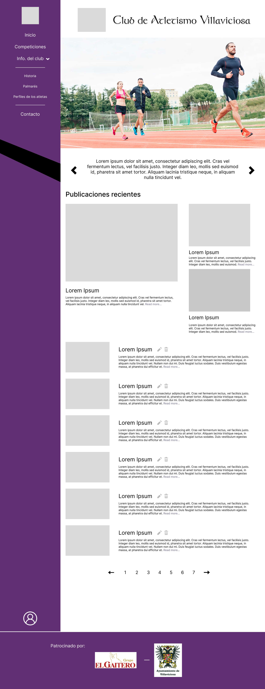
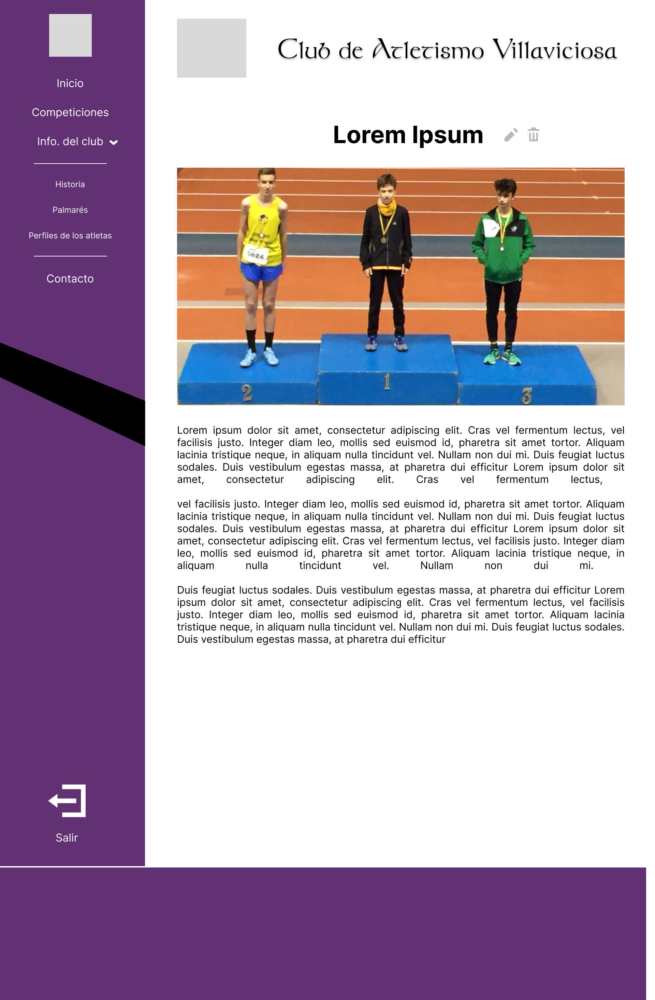
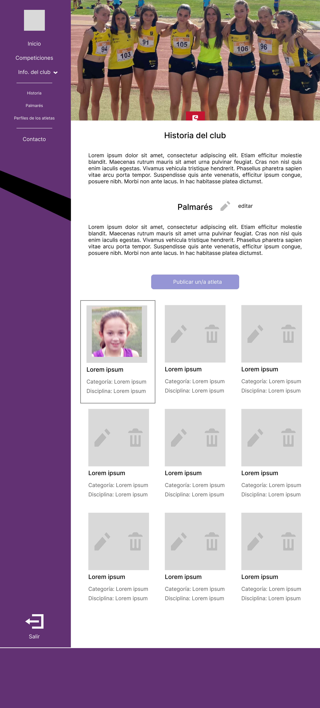
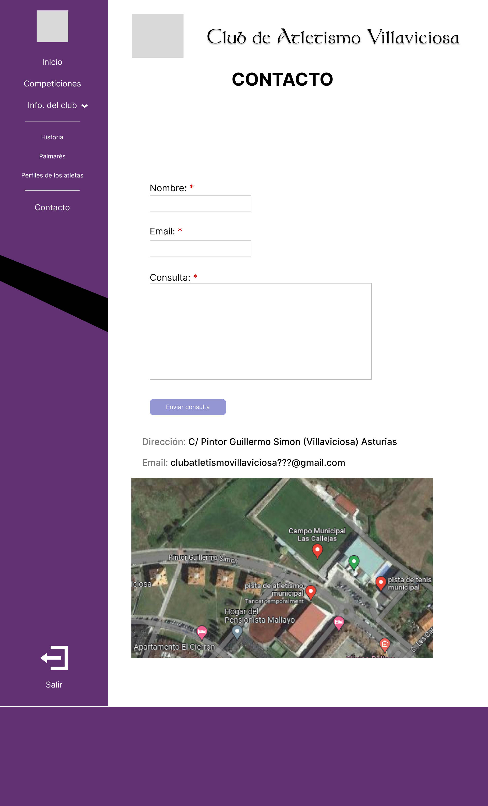
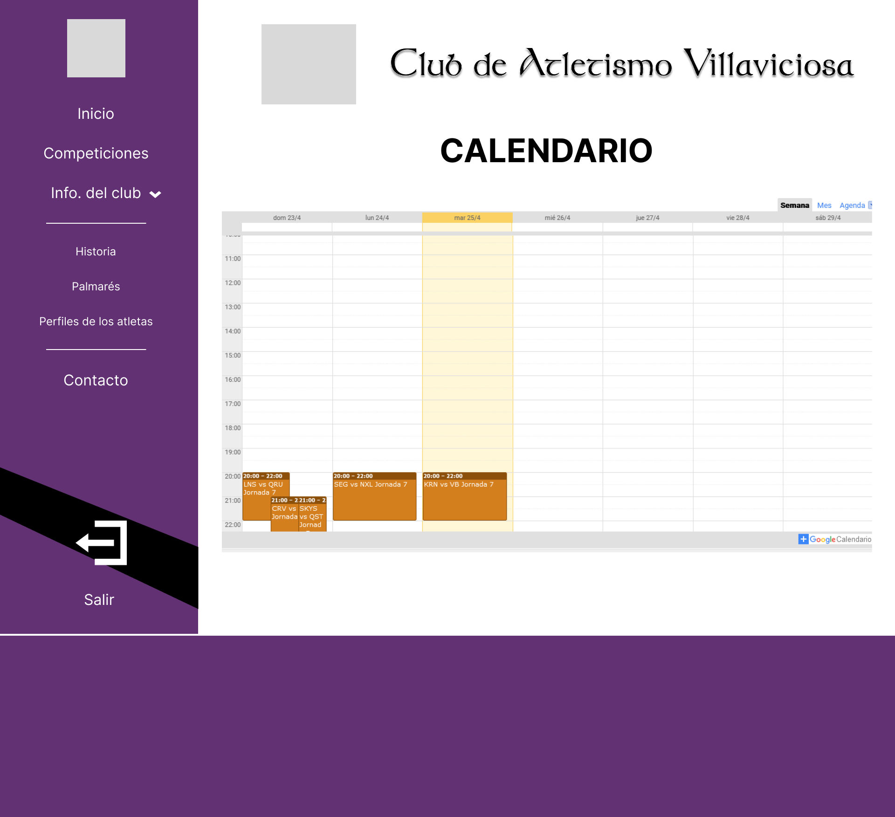
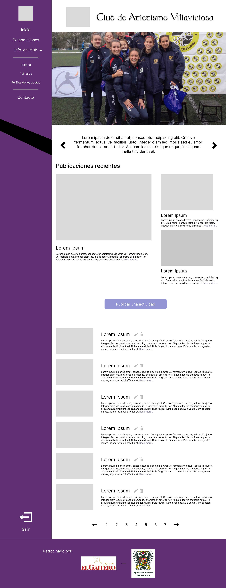

## El Gaitero Atletismo

1. [Descripción del proyecto](#projectdescription)
2. [Mockup](#mockup)
3. [Historias de usuario](#userstories)
4. [Página principal](#homepage)
5. [Miembros del equipo](#teammembers)
6. [Stacks](#stacks)
7. [Metodología](#methodology)
8. [Como instalar el proyecto](#install)
9. [Tests](#tests)

## 📝 1. Descripción del proyecto

Proyecto final que consiste en crear una página web de un club de atletismo.
Es una página con diferentes vistas para que las personas usuarias puedan acceder a la información del club.
En las diferentes vistas se podrá acceder a diferentes noticias, a historia, palmarés y perfiles de los atletas, a un calendario donde ver las carreras y actividades en que el club participe, y una vista de contacto donde usuari@s podrán pedir información, así como datos del club y un mapa con su localización.
La página también se podrá acceder como administrador, con un usuario y contraseña, para poder crear, actualizar y borrar contenido de las diferentes vistas.
Nuestro principal objetivo ha sido que sea una página funcional e intuitiva, en la cual las personas que accedan a la página no tengan ninguna dificultad para visualizarla.

## ✏️ 2. Mockup








## 3. Historias de usuario

<ul>
<li>Mobile First para los usuarios, Desktop First para el administrador</li>
<li>Yo como usuario quiero un buscador</li>
<li>Yo como usuario quiero tener una vista con el palmarés grupal del club</li>
<li>Yo como usuario quiero un calendario donde poder ver que competiciones se han hecho y cuales se van a hacer</li>
<li>Yo como usuario quiero tener una vista de contacto donde poder ver los datos del club (dirección y correo electrónico), y un mapa para poder visualizar la ubicación</li>
<li>Yo como usuario quiero ver las publicaciones de las actividades del club</li>
<li>Yo como usuario quiero poder navegar por las diferentes vistas mediante una barra de navegación (navbar)</li>
<li>Yo como usuario quiero que las publicaciones estén ordenadas cronológicamente</li>
<li>Yo como usuario quiero tener un formulario en la página de contacto para poder contactar con el club</li>
<li>Yo como usuario quiero tener una vista con la historia del club</li>
<li>Yo como usario quiero tener una vista con los perfiles de l@s atletas del club</li>

<li>Yo quiero que solo como administrador se pueda acceder a las opciones del CRUD</li>
<li>Yo como administrador quiero poder editar, borrar, añadir y actualizar las fotos de los atletas</li>
<li>Yo como administrador quiero poder editar, borrar, añadir y actualizar las noticias del club</li>
<li>Yo como administrador quiero poder modificar el palmarés del club</li>
<li>Yo como administrador quiero poder añadir, actualizar y borrar los eventos del calendario</li>
<li>Yo como administrador quiero poder acceder a un formulario con un botón desde la página principal</li>
<li>Yo como administrador quiero tener un login solo para administrador</li>
</ul>

## 🖥️ 4. Página principal


## 🧑‍💻 5. Miembros del equipo

| Nombre | Role | |
| :--- | :---: | :---: |
| Salah Raghib | Scrum Master | https://github.com/SalahREH |
| Christian Carbajo | Product Owner | https://github.com/ChristianCarbajo |
| Aurino Llera | Developer | https://github.com/Aurino4 |
| Javier Bres | Developer | https://github.com/JavierBres |


## 🔧 6. Stacks

<a href="https://www.w3.org/html/" target="_blank" rel="noreferrer">  </a>
<a href="https://www.w3.org/html/" target="_blank" rel="noreferrer">  </a>
<a href="https://developer.mozilla.org/es/docs/Web/JavaScript" target="_blank" rel="noreferrer">  </a>
<a href="https://react.dev" target="_blank" rel="noreferrer">  </a>

<a href="https://www.mysql.com" target="_blank" rel="noreferrer">  </a>
<a href="https://www.java.com/es/" target="_blank" rel="noreferrer">  </a>
<a href="https://spring.io/projects/spring-boot" target="_blank" rel="noreferrer">  </a>

<a href="https://code.visualstudio.com" target="_blank" rel="noreferrer">  </a>
<a href="https://www.jetbrains.com/idea/" target="_blank" rel="noreferrer">  </a>

<a href="https://www.postman.com" target="_blank" rel="noreferrer">  </a> 
<a href="https://www.apachefriends.org/es/index.html" target="_blank" rel="noreferrer">  </a>

<a href="https://www.atlassian.com/es/software/jira" target="_blank" rel="noreferrer">  </a> 
<a href="https://www.figma.com" target="_blank" rel="noreferrer">  </a>
<a href="https://www.atlassian.com/software/confluence/use-cases/wiki" target="_blank" rel="noreferrer">  </a>
<a href="https://slack.com" target="_blank" rel="noreferrer">  </a>

<a href="https://git-scm.com" target="_blank" rel="noreferrer">  </a>
<a href="https://github.com" target="_blank" rel="noreferrer">  </a>

## 📚 7. Metodología
<ul>
<li>Agile con SCRUM</li>
<li>Atomic design</li>
<li>Mob programming.</li>
<li>Pair programming.</li>
</ul>

## 💻 8. Como instalar el proyecto
BACK-END
1. Clonar el proyecto
```bash
git clone https://github.com/Club-de-Atletismo-Villaviciosa/Back-ClubAtletismoVillaviciosa.git
```
2. Activar el servidor y dejar el terminal abierto
```bash
Situarse en el archivo BackClubAtletismoVillaviciosaApplication.java y clicar Run (Shift + F10)
```

FRONT-END
1. Clonar el proyecto
```bash
git clone https://github.com/Club-de-Atletismo-Villaviciosa/Front-ClubAtletismoVillaviciosa.git
```

2. Acceder a la carpeta del proyecto
```bash
cd Front-ClubAtletismoVillaviciosa/
```

3. Instalar dependencias
```bash
npm install
```

4. Activar el servidor y guardar el terminal abierto
```bash
npm start
```   

## 🛠️ 9. Tests
FRONT-END
Se han efectuado 3 tipos de test:
<ul>
<li>Renderizado</li>
<li>Eventos</li>
<li>Enrutamiento</li>
<ul>

BACK-END
Se ha efectuado el testeado de todo el CRUD.
